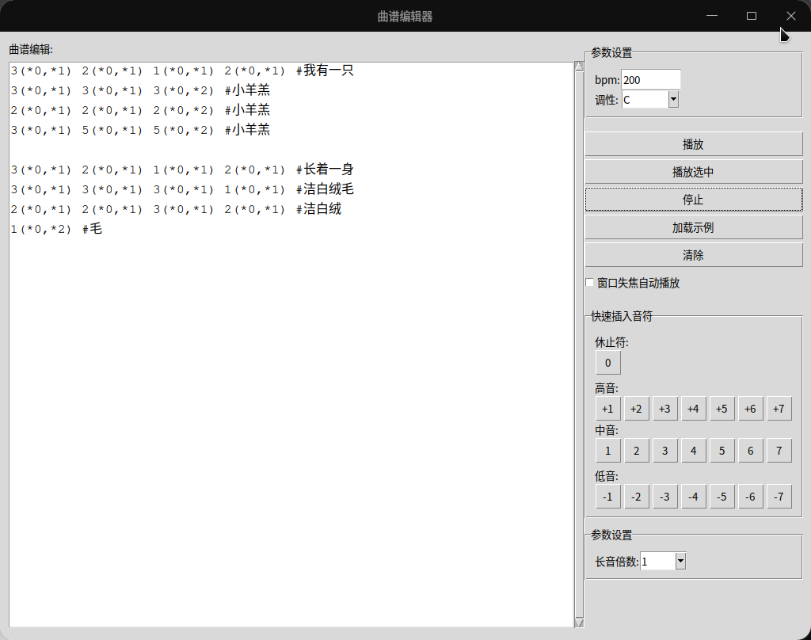

# PC Speaker Music Editor



> **⚠️ 注意：** 本程序只支持 linux 系统

PC Speaker Music Editor 是一个图形化界面的曲谱编辑与播放工具，使用 Python 和 Linux `beep` 命令实现。它允许用户通过简单的文本标记创建音乐，并通过计算机的内置扬声器实时播放。

## 功能特点

- **直观的简谱编辑**：使用数字表示音符（1-7），通过 `-` 和 `+` 前缀表示低音和高音
- **参数化音符控制**：可为每个音符指定延时和持续时间参数
- **相对参数设置**：使用倍数表示法（如 `*1.5`）相对于默认值调整参数
- **多调性支持**：支持12种调性（C到B）
- **播放控制**：支持播放整个曲谱或仅播放选中部分
- **快速编辑**：提供按钮快速插入音符和参数
- **示例曲谱**：内置《小星星》示例曲谱

## 安装与使用

### 系统要求
- Linux 系统
- Python 3.x
- `beep` 命令行工具

### 安装步骤

1. 安装依赖：
   ```bash
   sudo apt-get install beep python3-tk
   ```

2. 将用户添加到 input 组：
   ```bash
   sudo usermod -aG input $USER
   ```

3. 重新登录系统使组变更生效

4. 克隆仓库：
   ```bash
   git clone https://github.com/dsy4567/pc-speaker-music-editor.git
   cd pc-speaker-music-editor
   ```

5. 运行程序：
   ```bash
   python3 main.py
   ```

### 使用方法

1. **编辑曲谱**：
   - 使用数字 1-7 表示中音音符
   - 使用 `-1` 到 `-7` 表示低音音符
   - 使用 `+1` 到 `+7` 表示高音音符
   - 添加参数：`音符(延时,持续时间)`（例如 `1(100,300)`）

2. **参数设置**：
   - **延时倍数**：相对于默认延时的倍数（如 0.5 表示一半延时）
   - **长音倍数**：相对于默认持续时间的倍数（如 1.5 表示1.5倍时长）
   - **调性**：选择曲谱的调性（默认 C 调）

3. **播放控制**：
   - **播放**：播放整个曲谱
   - **播放选中**：仅播放选中的部分
   - **停止**：停止当前播放

## 曲谱示例

### 小星星
```
1 1 5 5 6 6 5
4 4 3 3 2 2 1
5 5 4 4 3 3 2
5 5 4 4 3 3 2
1 1 5 5 6 6 5
4 4 3 3 2 2 1
```

### 玛丽有只小羊羔
```
3 2 1 2 3 3 3
2 2 2
3 5 5
3 2 1 2 3 3 3
2 2 3 2 1
```

## 开发信息

此项目由 AI（DeepSeek-R1）生成，旨在提供一个简单易用的图形界面工具，用于通过 PC 扬声器创作和播放音乐。

## 贡献指南

欢迎贡献！请通过 Issues 提交问题或建议，通过 Pull Requests 提交代码改进。

## 许可证

本项目采用 [WTFPL 许可证](LICENSE)。

---

通过 PC Speaker Music Editor，您可以轻松创作简单的音乐曲谱并通过计算机扬声器实时播放。无论是音乐教育还是休闲娱乐，这都是一个有趣且实用的工具！
